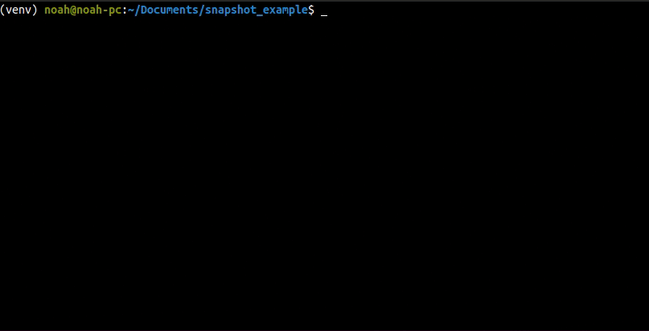

# syrupy


[](#contributors) [](https://github.com/tophat/getting-started/blob/master/scorecard.md) [](https://pypi.org/project/syrupy/) [](https://opensource.tophat.com/slack)

 [](https://pypi.org/project/syrupy/) [](https://pypi.org/project/syrupy/)  [](https://pypi.org/project/syrupy/) [](./LICENSE)

 [](https://codecov.io/gh/tophat/syrupy)

## Overview

Syrupy is a [pytest](https://docs.pytest.org/en/latest/) snapshot plugin. It enables developers to write tests which assert immutability of computed results.

## Motivation

The most popular snapshot test plugin compatible with pytest has some core limitations which this package attempts to address by upholding some key values:

- Extensible: If a particular data type is not supported, users should be able to easily and quickly add support.
- Idiomatic: Snapshot testing should fit naturally among other test cases in pytest, e.g. `assert x == snapshot` vs. `snapshot.assert_match(x)`.
- Soundness: Snapshot tests should uncover even the most minute issues. Unlike other snapshot libraries, Syrupy will fail a test suite if a snapshot does not exist, not just on snapshot differences.

## Installation

```shell
python -m pip install syrupy
```

### Migration from snapshottest

You cannot use syrupy alongside snapshottest due to argument conflicts. To ease migration, we've made syrupy aware of snapshottest call syntax. Simply uninstall snapshottest and remove old snapshots:

```shell
pip uninstall snapshottest -y;
find . -type d ! -path '*/\.*' -name 'snapshots' | xargs rm -r
```


## Usage

### Basic Usage

In a pytest test file `test_file.py`:

```python
def test_foo(snapshot):
    actual = "Some computed value!"
    assert actual == snapshot
```

when you run `pytest`, the above test should fail due to a missing snapshot. Re-run pytest with the update snapshots flag like so:

```shell
pytest --snapshot-update
```

A snapshot file should be generated under a `__snapshots__` directory in the same directory as `test_file.py`. The `__snapshots__` directory and all its children should be committed along with your test code.



#### Custom Objects

The default serializer supports all python built-in types and provides a sensible default for custom objects.

If you need to customise your object snapshot, it is as easy as overriding the default `__repr__` implementation.

```python
def __repr__(self) -> str:
    return "MyCustomClass(...)"
```

### Options

These are the cli options exposed to `pytest` by the plugin.

| Option                         | Description                                                                         | Default                                          |
| ------------------------------ | ----------------------------------------------------------------------------------- | ------------------------------------------------ |
| `--snapshot-update`            | Snapshots will be updated to match assertions and unused snapshots will be deleted. | `False`                                          |
| `--snapshot-warn-unused`       | Prints a warning on unused snapshots rather than fail the test suite.               | `False`                                          |
| `--snapshot-default-extension` | Use to change the default snapshot extension class.                                 | `syrupy.extensions.amber.AmberSnapshotExtension` |

### Built-In Extensions

Syrupy comes with a few built-in preset configurations for you to choose from. You should also feel free to extend the `AbstractSyrupyExtension` if your project has a need not captured by one our built-ins.

- **`AmberSnapshotExtension`**: This is the default extension which generates `.ambr` files. Serialization of most data types are supported.
- **`SingleFileSnapshotExtension`**: Unlike the `AmberSnapshotExtension`, which groups all tests within a single test file into a singular snapshot file, this extension creates one `.raw` file per test case.
- **`PNGSnapshotExtension`**: An extension of single file, this should be used to produce `.png` files from a byte string.
- **`SVGSnapshotExtension`**: Another extension of single file. This produces `.svg` files from an svg string.

### Advanced Usage

By overriding the provided [`AbstractSnapshotExtension`](./src/syrupy/extensions/base.py) you can implement varied custom behaviours.

See examples of how syrupy can be used and extended in the [test examples](./tests/examples).

### Extending Syrupy

- [Custom snapshot directory](./tests/examples/test_custom_snapshot_directory.py)
- [Custom snapshot name](./tests/examples/test_custom_snapshot_name.py)
- [Custom object snapshots](./tests/examples/test_custom_object_repr.py)
- [JPEG image extension](./tests/examples/test_custom_image_extension.py)
- [Built-in image extensions](./tests/test_extension_image.py)

## Uninstalling

```python
pip uninstall syrupy
```

If you have decided not to use Syrupy for your project after giving us a try, we'd love to get your feedback. Please create a GitHub issue if applicable, or drop a comment in our [Slack channel](https://opensource.tophat.com/slack).

## Contributing

Feel free to open a PR or GitHub issue. Contributions welcome!

To develop locally, clone this repository and run `. script/bootstrap` to install test dependencies. You can then use `invoke --list` to see available commands.

### See contributing [guide](./CONTRIBUTING.md)

## Contributors

<!-- ALL-CONTRIBUTORS-LIST:START - Do not remove or modify this section -->
<!-- prettier-ignore-start -->
<!-- markdownlint-disable -->
<table>
  <tr>
    <td align="center"><a href="https://noahnu.com"><br /><sub><b>Noah</b></sub></a><br /><a href="#infra-noahnu" title="Infrastructure (Hosting, Build-Tools, etc)">🚇</a> <a href="#ideas-noahnu" title="Ideas, Planning, & Feedback">🤔</a> <a href="https://github.com/tophat/syrupy/commits?author=noahnu" title="Code">💻</a> <a href="https://github.com/tophat/syrupy/commits?author=noahnu" title="Documentation">📖</a> <a href="https://github.com/tophat/syrupy/commits?author=noahnu" title="Tests">⚠️</a></td>
    <td align="center"><a href="http://emmanuel.ogbizi.com"><br /><sub><b>Emmanuel Ogbizi</b></sub></a><br /><a href="https://github.com/tophat/syrupy/commits?author=iamogbz" title="Code">💻</a> <a href="#design-iamogbz" title="Design">🎨</a> <a href="#infra-iamogbz" title="Infrastructure (Hosting, Build-Tools, etc)">🚇</a> <a href="https://github.com/tophat/syrupy/commits?author=iamogbz" title="Documentation">📖</a> <a href="https://github.com/tophat/syrupy/commits?author=iamogbz" title="Tests">⚠️</a></td>
    <td align="center"><a href="https://github.com/adamlazz"><br /><sub><b>Adam Lazzarato</b></sub></a><br /><a href="https://github.com/tophat/syrupy/commits?author=adamlazz" title="Documentation">📖</a></td>
    <td align="center"><a href="https://mcataford.github.io"><br /><sub><b>Marc Cataford</b></sub></a><br /><a href="https://github.com/tophat/syrupy/commits?author=mcataford" title="Code">💻</a> <a href="https://github.com/tophat/syrupy/commits?author=mcataford" title="Tests">⚠️</a></td>
    <td align="center"><a href="http://msrose.github.io"><br /><sub><b>Michael Rose</b></sub></a><br /><a href="https://github.com/tophat/syrupy/commits?author=msrose" title="Code">💻</a> <a href="https://github.com/tophat/syrupy/commits?author=msrose" title="Tests">⚠️</a></td>
    <td align="center"><a href="http://fashionablenonsense.com/"><br /><sub><b>Jimmy Jia</b></sub></a><br /><a href="https://github.com/tophat/syrupy/commits?author=taion" title="Code">💻</a> <a href="https://github.com/tophat/syrupy/commits?author=taion" title="Tests">⚠️</a></td>
  </tr>
</table>

<!-- markdownlint-enable -->
<!-- prettier-ignore-end -->
<!-- ALL-CONTRIBUTORS-LIST:END -->
This section is automatically generated via tagging the all-contributors bot in a PR:

```text
@all-contributors please add <username> for <contribution type>
```

## License

Syrupy is licensed under [Apache License Version 2.0](./LICENSE).
